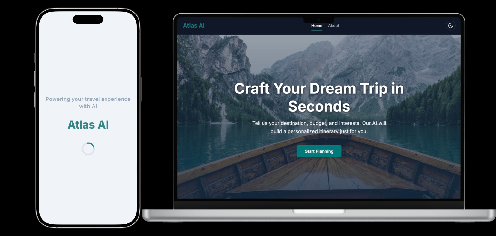

# 🌍 Atlas AI – Your Intelligent Travel Assistant



Atlas AI is a cutting-edge, AI-powered travel assistant designed to help you effortlessly create personalized travel itineraries. Plan smarter, travel better!

---

## ✨ Key Features

* **🤖 AI-Powered Travel Planning**: Let advanced AI algorithms craft the perfect itinerary based on your preferences.
* **🗺️ Personalized Itinerary Generation**: Tailored suggestions uniquely designed for your travel style and interests.
* **🎨 Interactive UI**: Beautiful, user-friendly interface supporting both light and dark modes.
* **📄 PDF Export**: Easily export and share your customized travel plans as PDF files.

---

## 🚀 Quick Start

Follow these simple steps to get Atlas AI running locally:

### 📌 Prerequisites

* [Node.js 16+](https://nodejs.org/en/download/)

### 🛠️ Installation

1. Clone the repository and install dependencies:

   ```bash
   npm install
   ```

2. Set your **Gemini API key**:

   Create a file named `.env.local` in the root directory and add:

   ```env
   GEMINI_API_KEY=your_api_key_here
   ```

3. Start the development server:

   ```bash
   npm run dev
   ```

4. Open your browser and visit:

   [http://localhost:5173](http://localhost:5173)

---

## 🌐 Build & Preview for Production

To build and preview the production-ready version:

```bash
npm run build
npm run preview
```

---

## 📸 Screenshots

*(Optional: Add attractive screenshots or GIFs here to showcase the application's UI and features.)*

---

## 🤝 Contributing

Contributions, suggestions, and feature requests are warmly welcomed!

---

## 📄 License

Atlas AI is licensed under the MIT License.

---

✨ **Happy traveling with Atlas AI!** ✈️
